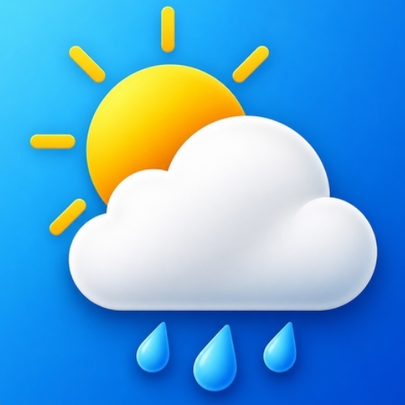
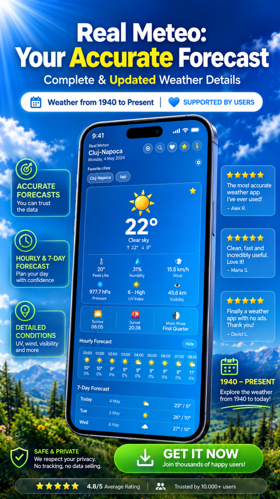
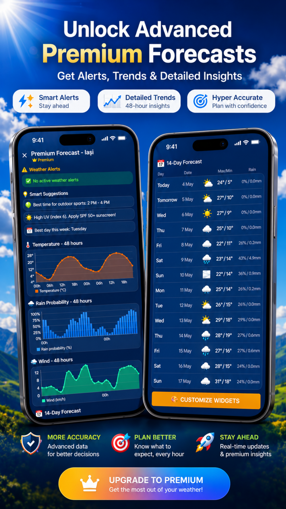
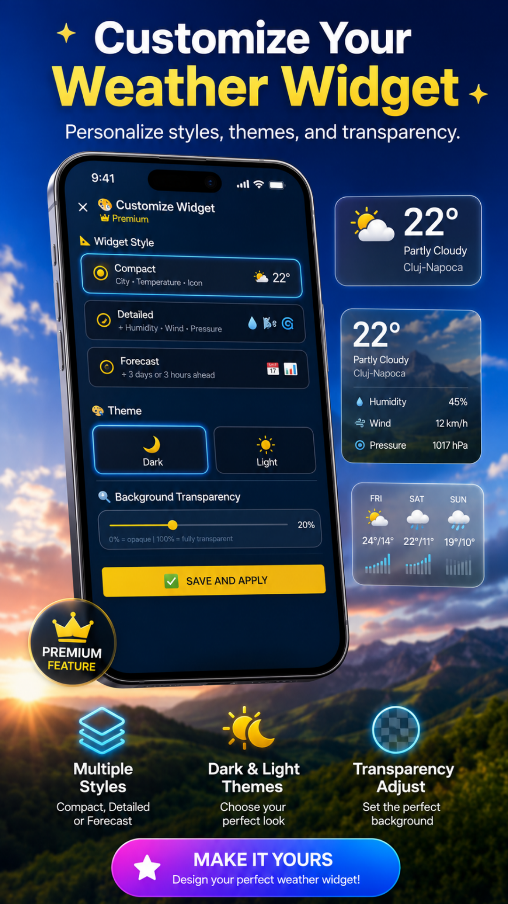
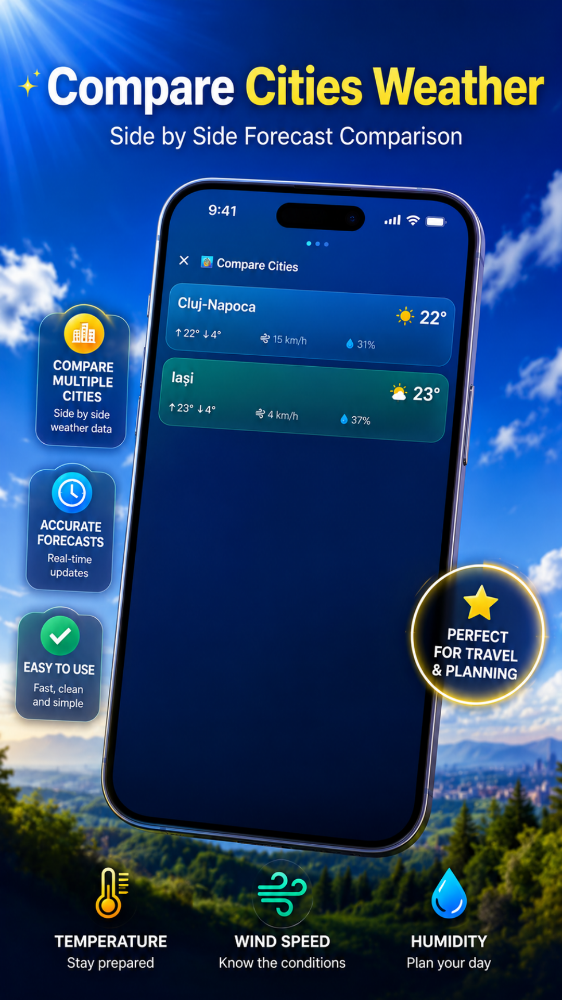

 

# 🌤️ RealMeteo

### Weather, Forecast, Widgets & Alerts

**Modern weather app for Romania and the entire world.**  
Clean. Fast. Zero third-party ads. Zero tracking.

 

---

---

## 🌤️ About RealMeteo

**RealMeteo** is a modern weather application for Romania and the world.
It provides real-time weather conditions, detailed hourly and daily forecasts,
home screen widgets, weather alerts, and favorite cities — all in a fast and
elegant interface.

Weather data is powered by **[Open-Meteo](https://open-meteo.com/)** —
a free, open-source, globally accurate weather API.

> ### 🛡️ Zero Third-Party Ads
> No banners · No interstitials · No native ads · No advertising identifiers  
> Funded entirely by optional Supporter contributions and Premium subscriptions.

---

## ✨ Features

### 🌡️ Real-Time Weather
- Current temperature and weather conditions
- **7-day** detailed forecast
- **Hourly** forecast for the next 24 hours
- Feels-like temperature and humidity
- Wind speed, atmospheric pressure, and UV index
- Visibility, sunrise, sunset, and moon phases
- Rain probability and precipitation amounts
- Celsius and Fahrenheit support

### 🌍 Global Coverage
Check the forecast for **București, Cluj-Napoca, Iași, Timișoara, Constanța,
Piatra Neamț**, and any major city worldwide — perfect for commuting, travel,
hiking, skiing, beach days, or any outdoor activity.

### 📱 Home Screen Widgets

| Widget | Description |
|---|---|
| **Compact** | Current temperature at a glance |
| **Large** | 3-day forecast overview |
| **Hourly** | Next 3 hours forecast |
| **Premium** | Fully customizable with themes & transparency |

All widgets support direct refresh, light and dark themes, and display options.

### 🔔 Weather Notifications
- ☀️ Morning daily weather briefing
- 🌡️ Extreme temperature alerts
- 🌧️ Rain, wind, snow, and storm alerts
- 🏔️ Outdoor activity recommendations

> Notification availability depends on device permissions and settings.

### 🏙️ Additional Features
- **Favorite cities** with quick navigation
- **Smart offline cache** — intelligent local caching for offline use
- **Romanian and English** language support
- **Celsius / Fahrenheit** toggle

---

## 👑 Premium Features

| Feature | Free | Premium |
|---|:---:|:---:|
| 7-day forecast | ✅ | ✅ |
| Hourly forecast | ✅ | ✅ |
| Favorite cities | ✅ | ✅ |
| Home screen widgets | ✅ | ✅ |
| **14-day extended forecast** | ❌ | ✅ |
| **Interactive temperature charts** | ❌ | ✅ |
| **Rain probability & wind charts** | ❌ | ✅ |
| **Smart weather suggestions** | ❌ | ✅ |
| **Weather alerts** | ❌ | ✅ |
| **City weather comparison** | ❌ | ✅ |
| **Customizable Premium widget** | ❌ | ✅ |
| Remove support cards & messages | ❌ | ✅ |

---

## 💳 Pricing

RealMeteo remains **free** thanks to community support.  
All paid tiers are optional.

### One-Time Purchases

| Product | Price | Description |
|---|:---:|---|
| 💎 **RealMeteo Premium Lifetime** | €24.99 | All Premium features permanently. Lifetime Premium badge + exclusive app icons. |
| ❤️ **RealMeteo Supporter** | €2.99 | One-time support contribution. Supporter badge + removes support cards & messages. |

### Subscriptions

| Product | ID | Price | Trial | Benefits |
|---|---|:---:|:---:|---|
| 👑 **RealMeteo Premium** | `premium_monthly` | €2.99/mo | 7 days free | 14-day forecast · alerts · charts · smart suggestions · premium widget · no support messages |
| ❤️ **Monthly Supporter** | `supporter_monthly` | €1.99/mo | — | Monthly Supporter badge · exclusive app icons · removes support messages |

> ❤️ Supporter plans are entirely optional and help keep RealMeteo free,
> ad-free, and actively developed. Thank you to everyone who contributes.

---

## 🛡️ Privacy

RealMeteo is built with **privacy as a core principle:**

| | |
|---|---|
| ❌ | No third-party advertising networks |
| ❌ | No banner, interstitial, or native ads |
| ❌ | No advertising identifiers (GAID) |
| ❌ | No analytics or crash-reporting SDKs |
| ❌ | No user profiling of any kind |
| ✅ | Weather data from Open-Meteo (open-source, Germany) |
| ✅ | Purchases managed by Google Play + RevenueCat (anonymous ID only) |
| ✅ | All preferences stored locally on your device |
| ✅ | GDPR, CCPA, and U.S. state privacy law compliant |

→ **[Full Privacy Policy](./PRIVACY_POLICY.md)**

---

## 🔗 Download

**[go.deniscasian.com/realmeteo](https://go.deniscasian.com/realmeteo)**

---

## 🌦️ Weather Data Attribution

RealMeteo uses **[Open-Meteo](https://open-meteo.com/)** for weather data.  
Open-Meteo is a free, open-source weather API with global coverage,
licensed under [CC BY 4.0](https://creativecommons.org/licenses/by/4.0/).

---

## 📄 Legal Documents

| Document | Description |
|---|---|
| [Privacy Policy](./PRIVACY_POLICY.md) | How we handle (and don't handle) your data |
| [Terms of Use](./TERMS_OF_SERVICE.md) | Rules for using RealMeteo |
| [License](./LICENSE) | Proprietary software license |
| [Security Policy](./SECURITY.md) | How to report vulnerabilities |
| [Changelog](./CHANGELOG.md) | Version history |
| [Support](./SUPPORT.md) | Help and contact information |

---

## 👤 Developer

**Denis Casian** — Independent developer, Romania 🇷🇴

| | |
|---|---|
| 🌐 Website | [deniscasian.com](https://deniscasian.com) |
| 📧 Support | [support@deniscasian.com](mailto:support@deniscasian.com) |
| 🐛 Bug Reports | [bugs.deniscasian.com](https://bugs.deniscasian.com) |
| 📱 App | [go.deniscasian.com/realmeteo](https://go.deniscasian.com/realmeteo) |

---

Made with ❤️ for Romania and the world.

**[Download RealMeteo](https://go.deniscasian.com/realmeteo)** ·
**[Privacy Policy](./PRIVACY_POLICY.md)** ·
**[Terms of Use](./TERMS_OF_SERVICE.md)**

*© 2026 RealMeteo. All rights reserved.*

