

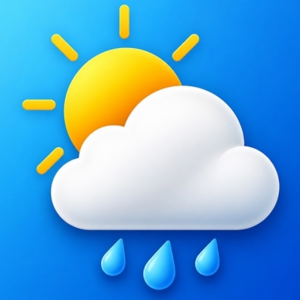

# 🌤️ RealMeteo

### Weather, Forecast, Widgets & Alerts

**Modern weather app for Romania and the entire world.**  
Clean. Fast. Free with optional ad-free Supporter tiers.

 

---
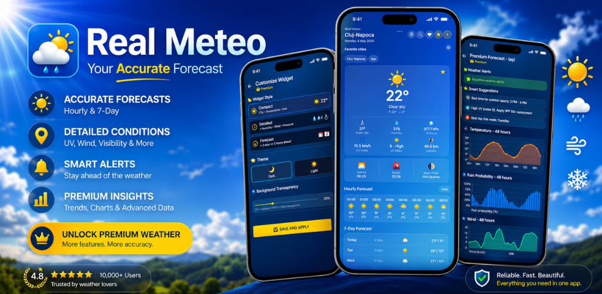

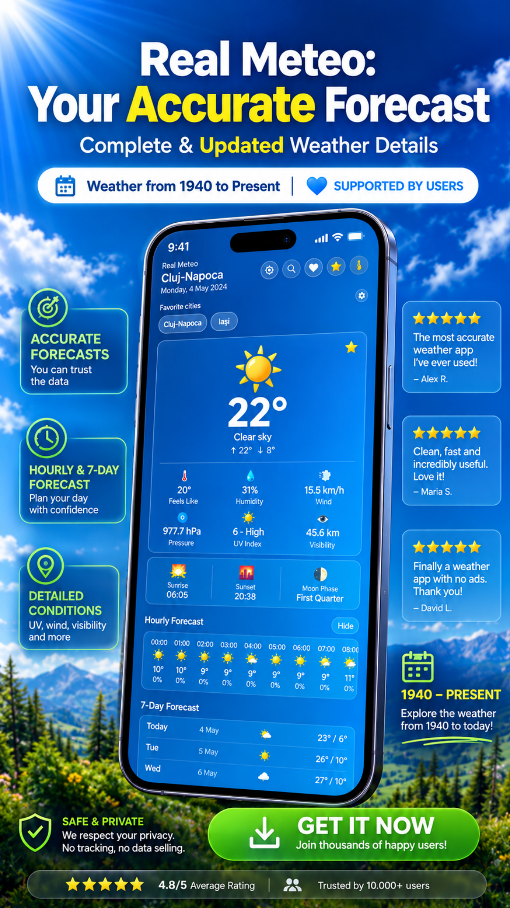
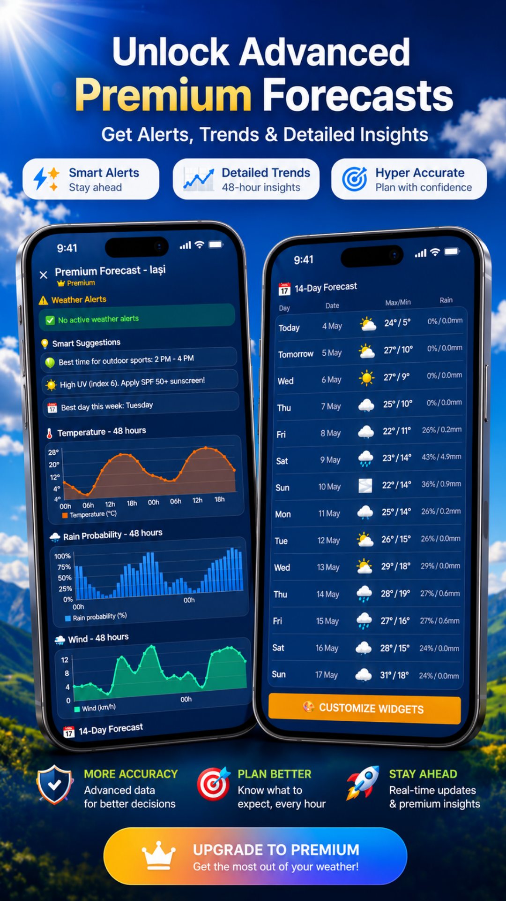
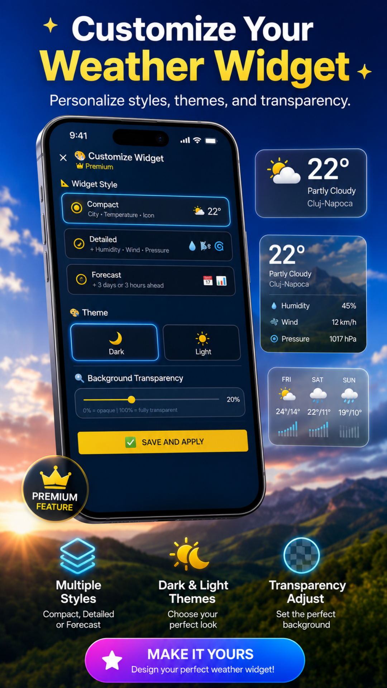
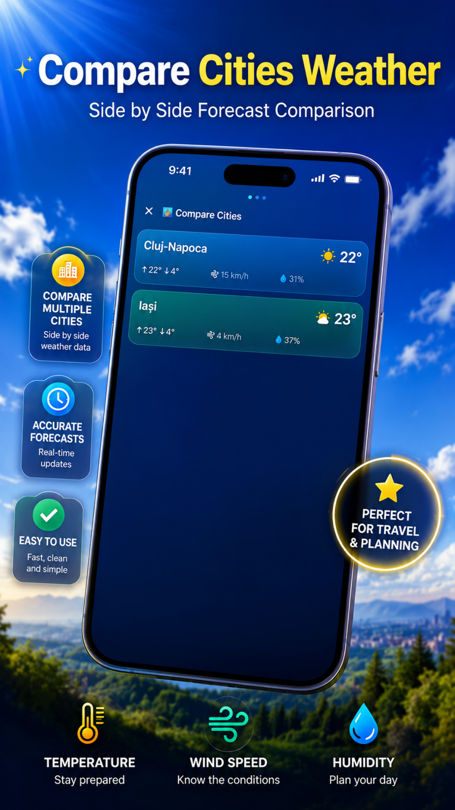
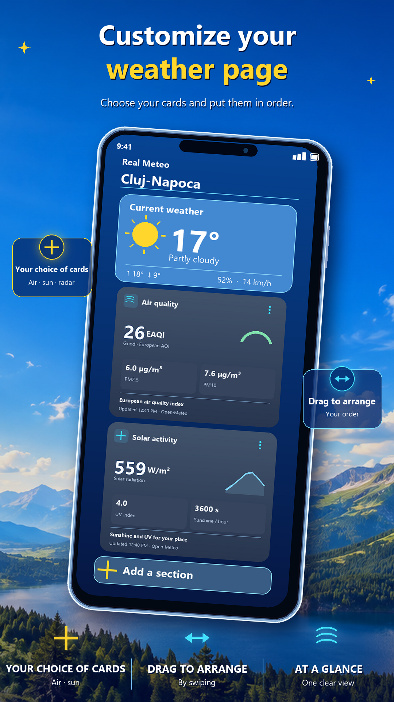
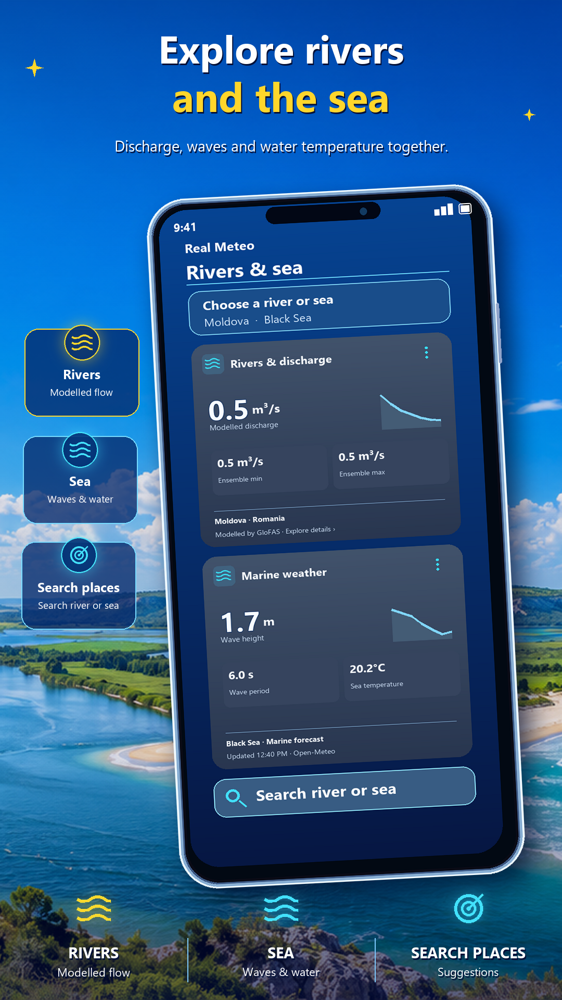
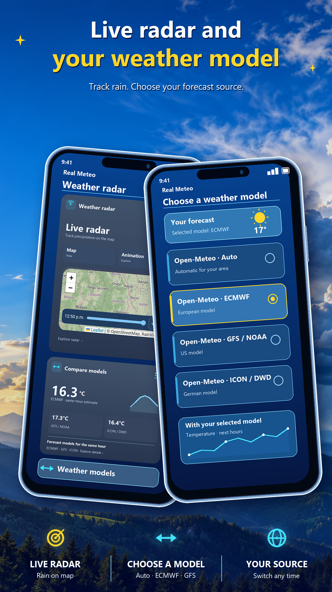

Tablet previews

 
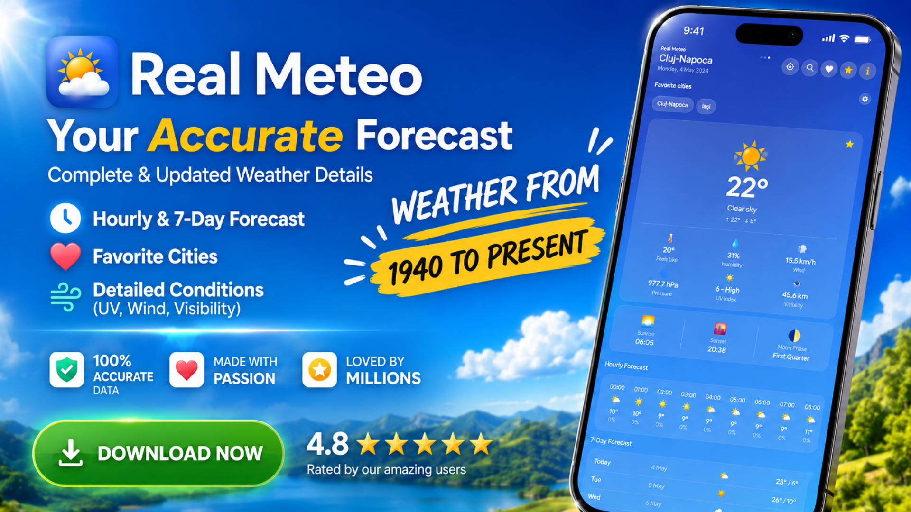
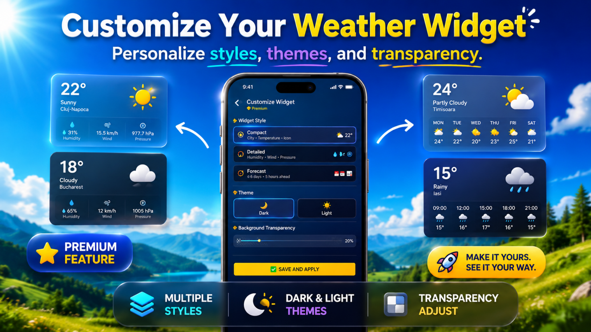
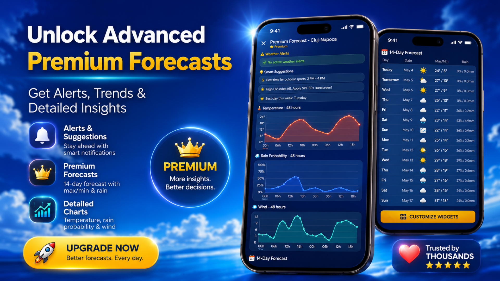
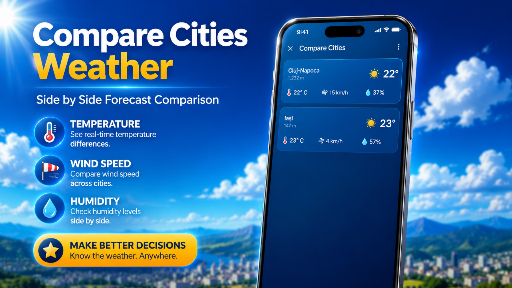
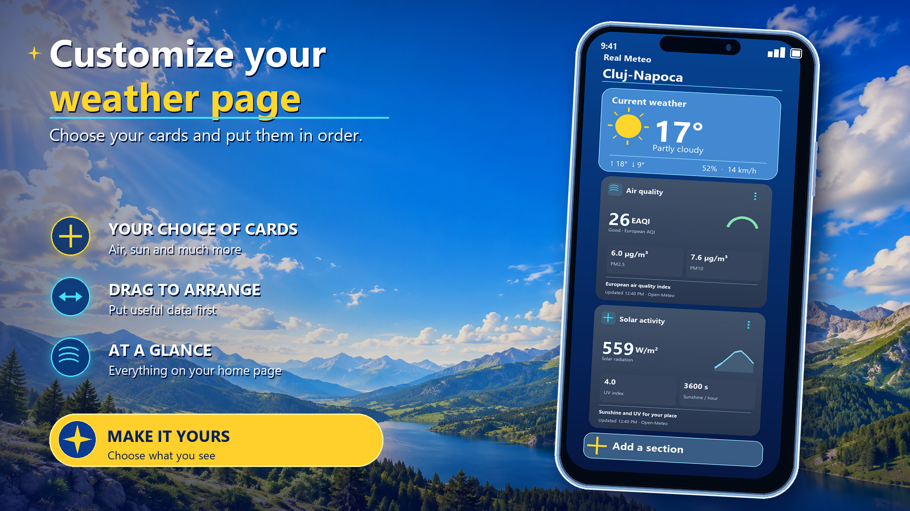
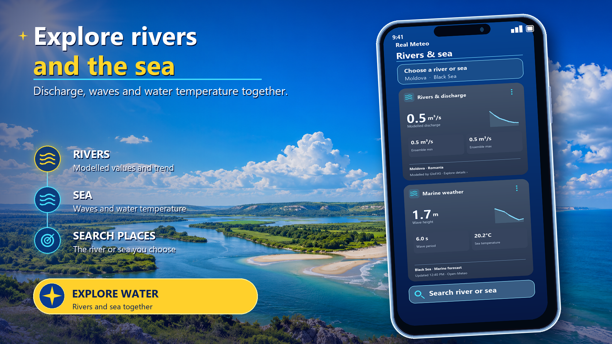
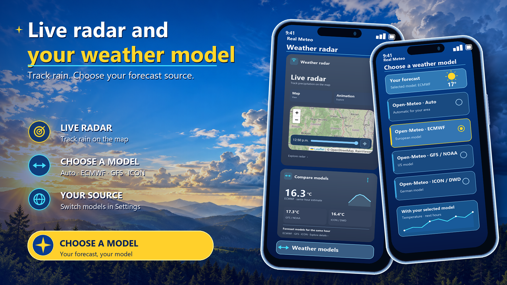

---

## 🌤️ About RealMeteo

**RealMeteo** is a modern weather application for Romania and the world.
It provides real-time weather conditions, detailed hourly and daily forecasts,
home screen widgets, weather alerts, and favorite cities — all in a fast and
elegant interface.

Weather data is powered by **[Open-Meteo](https://open-meteo.com/)** —
an open-source weather data platform.

> ### 🔔 Free App — Supported by Advertising
> RealMeteo is free and funded by **Google AdMob** advertising.  
> **Supporter** removes ads permanently; **Monthly Supporter** removes them while the subscription is active.  
> Premium and Premium Lifetime unlock features — they do **not** remove ads.

---

## ✨ Features

### 🌡️ Real-Time Weather
- Current temperature and weather conditions
- **7-day** detailed forecast
- **Hourly** forecast for the next 24 hours
- Feels-like temperature and humidity
- Wind speed, **wind direction**, atmospheric pressure, and UV index
- Visibility, sunrise, sunset, and moon phases
- Rain probability and precipitation amounts
- Celsius and Fahrenheit support, 12/24-hour clock, and unit choices
- Historical weather and interactive weather charts

### 🧩 Your Weather Page
- Add, remove, and reorder the cards on the main page
- Explore air quality, soil conditions, solar activity, cloud layers, dew point, and more
- Search for a river or coastal location to view modeled discharge or marine forecasts
- Follow precipitation on the live radar map
- Select an Open-Meteo forecast model in Settings and compare models side by side

### 🌍 Global Coverage
Check the forecast for **București, Cluj-Napoca, Iași, Timișoara, Constanța,
Piatra Neamț**, and any major city worldwide — perfect for commuting, travel,
hiking, skiing, beach days, or any outdoor activity.

### 📱 Home Screen Widgets

| Widget | Description |
|---|---|
| **Compact** | Current temperature at a glance |
| **Large** | 3-day forecast overview |
| **Hourly** | Next 3 hours forecast |
| **Date & Time** | Current date and time with weather |
| **Premium** | Fully customizable with themes & transparency |

All widgets support direct refresh, light and dark themes, and display options.

### 🔔 Weather Notifications
- ☀️ Morning daily weather briefing
- 🌡️ Extreme temperature alerts
- 🌧️ Rain, wind, snow, and storm alerts
- 🏔️ Outdoor activity recommendations

> Notification availability depends on device permissions and settings.

### 🏙️ Additional Features
- **Favorite cities** with quick navigation
- **Smart offline cache** — intelligent local caching for offline use
- **Romanian and English** language support
- **Celsius / Fahrenheit** toggle
- **Weather model selection** and additional measurement units

---

## 👑 Premium Features

| Feature | Free | Premium |
|---|:---:|:---:|
| 7-day forecast | ✅ | ✅ |
| Hourly forecast | ✅ | ✅ |
| Favorite cities | ✅ | ✅ |
| Home screen widgets | ✅ | ✅ |
| Customizable main-page cards | ✅ | ✅ |
| Live radar, river and marine information | ✅ | ✅ |
| Weather source selection | ✅ | ✅ |
| **14-day extended forecast** | ❌ | ✅ |
| **Interactive temperature charts** | ❌ | ✅ |
| **Rain probability & wind charts** | ❌ | ✅ |
| **Smart weather suggestions** | ❌ | ✅ |
| **Weather alerts** | ❌ | ✅ |
| **City weather comparison** | ❌ | ✅ |
| **Customizable Premium widget** | ❌ | ✅ |
| **Additional charts and insights within detailed weather cards** | ❌ | ✅ |
| Remove support cards & messages | ❌ | ✅ |

---

## 💳 Pricing

RealMeteo is **free** and supported by Google AdMob advertising.  
All paid tiers are optional.

### One-Time Purchases

| Product | Description |
|---|---|
| 💎 **RealMeteo Premium Lifetime** | All Premium features permanently. Lifetime Premium badge + exclusive app icons. **Ads are still shown.** |
| ❤️ **RealMeteo Supporter** | **Removes all advertising permanently.** One-time support contribution. Supporter badge. |

### Subscriptions

| Product | ID | Benefits |
|---|---|---|
| 👑 **RealMeteo Premium** | `premium_monthly` | 14-day forecast · alerts · charts · smart suggestions · premium widget · detailed-card insights. **Ads are still shown.** |
| ❤️ **Monthly Supporter** | `supporter_monthly` | **Removes all advertising** while active · Monthly Supporter badge · exclusive app icons |

Current prices and any trial offer are shown in Google Play before purchase.

> ❤️ Supporter plans remove all advertising and help keep RealMeteo free and
> actively developed. Thank you to everyone who contributes.

---

## 🛡️ Privacy

RealMeteo is built with **privacy as a core principle:**

| | |
|---|---|
| 🔔 | Google AdMob advertising shown to free users |
| ✅ | Supporter tier removes all advertising permanently |
| ❌ | No analytics or crash-reporting SDKs |
| ❌ | No advertising ID accessed for Supporter users |
| ❌ | No user profiling of any kind |
| ✅ | Weather data from Open-Meteo (open-source, Germany) |
| ✅ | Purchases managed by Google Play + RevenueCat (anonymous ID only) |
| ✅ | All preferences stored locally on your device |
| ✅ | GDPR, CCPA, and U.S. state privacy law compliant |

→ **[Full Privacy Policy](https://policy.rdcapps.com/realmeteo)**

---

## 🔗 Download

**[Google Play](https://play.google.com/store/apps/details?id=com.realmeteo.dc)**

---

## 🌦️ Weather Data Attribution

RealMeteo uses **[Open-Meteo](https://open-meteo.com/)** for weather data.  
Open-Meteo is a free, open-source weather API with global coverage,
licensed under [CC BY 4.0](https://creativecommons.org/licenses/by/4.0/).

---

## 📄 Legal Documents

| Document | Description |
|---|---|
| [Privacy Policy](https://policy.rdcapps.com/realmeteo) | How we handle (and don't handle) your data |
| [Terms of Use](https://terms.rdcapps.com/realmeteo) | Rules for using RealMeteo |
| [License](./LICENSE) | Proprietary software license |
| [Security Policy](./SECURITY.md) | How to report vulnerabilities |
| [Changelog](./CHANGELOG.md) | Version history |
| [Support](./SUPPORT.md) | Help and contact information |

---

## 👤 Developer

**Denis Casian** — Independent developer, Romania 🇷🇴

| | |
|---|---|
| 🌐 Website | [rdcapps.com](https://rdcapps.com) |
| 📧 Support | [support@rdcapps.com](mailto:support@rdcapps.com) |
| 🐛 Bug Reports | [bugs.rdcapps.com](https://bugs.rdcapps.com) |
| 📱 App | [Google Play](https://play.google.com/store/apps/details?id=com.realmeteo.dc) |

---

Made with ❤️ for Romania and the world.

**[Download RealMeteo](https://play.google.com/store/apps/details?id=com.realmeteo.dc)** ·
**[Privacy Policy](https://policy.rdcapps.com/realmeteo)** ·
**[Terms of Use](https://terms.rdcapps.com/realmeteo)**

*© 2026 RealMeteo. All rights reserved.*

